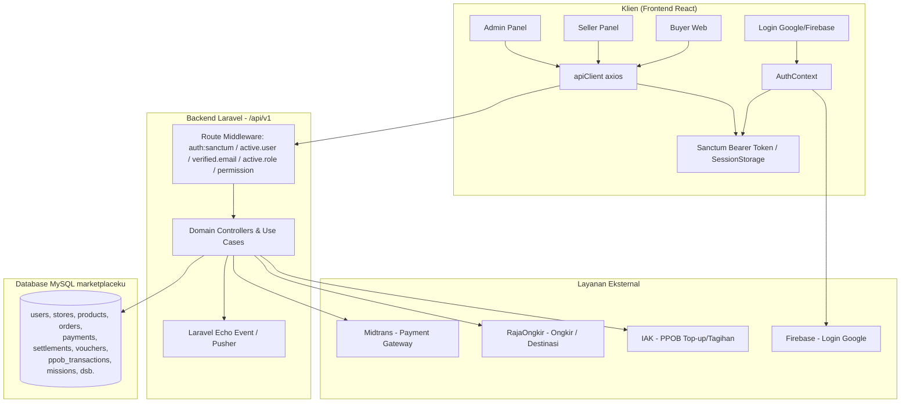
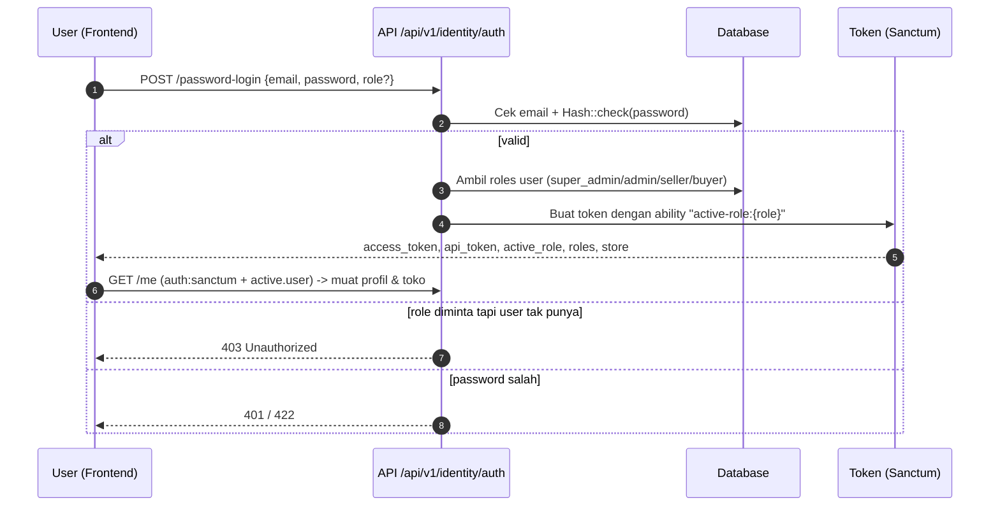

# Penjelasan Aplikasi Marketplace (Ziip / MarketKu)

Dokumen ini menjelaskan aplikasi **marketplace e-commerce** secara menyeluruh, termasuk arsitektur, alur kerja, dan penjelasan setiap fitur yang ada saat ini.

---

## 1. Gambaran Umum

Aplikasi ini adalah **marketplace multi-vendor (platform) hijau & terpercaya** yang menghubungkan tiga peran utama: **Buyer (pembeli)**, **Seller (penjual/toko)**, dan **Admin (pengelola platform)**. Di atas marketplace, aplikasi juga menyediakan layanan **PPOB** (Pulsa, Data, Token Listrik, Tagihan, Internet, Voucher) dan **Game / Gamifikasi** (Arithmetic Kilat & Sudoku) sebagai sarana engagement pengguna.

### 1.1 Teknologi / Stack
| Lapisan | Teknologi |
|---------|-----------|
| Backend (API) | Laravel 11 (PHP 8.3), arsitektur **Domain-Driven Design** (folder `app/Domains/...`) |
| Frontend Web | React + Vite, TanStack Query, React Router, Tailwind/Styled |
| Database | MySQL (`marketplaceku`) |
| Autentikasi | Laravel Sanctum (token) + Firebase Auth (login Google) |
| Realtime | Laravel Echo + Pusher (notifikasi & chat) |
| Pembayaran | Midtrans (Snap token + Webhook) |
| Ongkir | RajaOngkir (komerce endpoint) |
| PPOB | Provider IAK (stage/mobilepulsa) |

### 1.2 Struktur Proyek
```
marketplace/
├── market-api/          # Backend Laravel (API)
│   └── app/Domains/     # Modul DDD: Admin, Catalog, Communication, Engagement,
│                        #   Finance, Identity, Order, PPOB, Seller, Shared, Support, Template
├── market-frontend/     # Frontend React/Vite
│   └── src/
│       ├── core/        # apiClient, routing, auth context, utils, realtime
│       ├── features/    # catalog, order, seller, admin, advanced, profile, ppob, auth, communication
│       └── shared/      # layout, komponen CRUD/UI, service, hooks
├── market-game/                # Dokumen roadmap/audit
└── penjelasan.md        # (file ini)
```

---

## 2. Arsitektur & Alur Sistem

### 2.1 Diagram Arsitektur Tingkat Tinggi



### 2.2 Diagram Alur Login & Peran (Role)



**Alur Peran:**
- Satu user dapat memiliki **banyak peran** (mis. `seller` + `buyer`).
- Login/`switch-role` memilih **Active Role** → dikontrol lewat ability token `active-role:{role}` dan middleware `active.user` / `active.role:admin|seller`.
- Role yang ada: `super_admin`, `admin`, `seller`, `buyer` (+ peran uji).

### 2.3 Diagram Alur Checkout & Pembayaran (Buyer)

```mermaid
flowchart LR
    A[Keranjang Cart] --> B[Checkout / CheckoutPage]
    B --> C[Pilih Alamat + Destination RajaOngkir]
    B --> D[Shipping Calculator - hitung ongkir]
    B --> E[Terapkan Voucher diskon]
    B --> F[POST /api/v1/orderings -> CreateOrderUseCase]
    F --> G[Lock baris produk_variants lockForUpdate]
    G --> H[Cek & potong stok (race-safe)]
    G --> I[Cek & pakai voucher (exists-guard)]
    G --> J[Siapkan order + sub_orders per toko]
    J --> K[Midtrans Snap Token / CreateTransaction]
    K --> L[Webhook POST /payments/midtrans/notification]
    L --> M[ProcessPaymentUseCase: DB::transaction + lock order]
    M --> N[Idempotent: cek duplikat pembayaran]
    M --> O[Tandai order = paid, kurangi stok final]
    O --> P[Terbit notifikasi + event realtime ke seller]
```

> **Keamanan pembayaran:** `ProcessPaymentUseCase::execute` dibungkus `DB::transaction` + `lockForUpdate` pada baris order sehingga cek-then-insert menjadi serial → **mencegah duplikat / race condition** saat dua request pembayaran tiba bersamaan.

---

## 3. Modul & Fitur Backend (per Domain)

Semua route berada di bawah prefix **`/api/v1`**. Middleware umum: `auth:sanctum`, `active.user`, `verified.email`, `active.role:...`, `permission:...`, dan `throttle`.

### 3.1 Identity (Auth + User) — `/api/v1/identity`
- **Auth** (`/auth`):
  - `POST /password-register` (buat akun & email harus diverifikasi).
  - `POST /password-login` (throttle 30/menit) — login password dengan pilihan `role`.
  - `POST /firebase-login` (validasi token Google/Firebase).
  - `POST /forgot-password`, `POST /reset-password` (throttle 5/menit).
  - (auth) `POST /logout`, `/logout-other-devices`, `/logout-all-devices`.
  - (auth + active.user) `GET /me`, `POST /switch-role`, `POST /change-password`, `DELETE /account`, `POST /register-seller` (onboarding toko).
- **User** (`/users`): CRUD profile (termasuk update `avatar`), cari by email, dsb. **Aman dari IDOR** — hanya pemilik/authorized yang mengakses datanya sendiri.

### 3.2 Catalog (Produk, Kategori, Media, Promosi) — `/api/v1/catalog`
- Produk: list, detail by slug/id, varian, atribut. Admin/seller CRUD.
- Kategori (`/categories`): tree menu, path-based, produk per kategori.
- Catalog Group (`/catalog-groups`): pengelompokan kategori.
- Media (`/media/images`): unggah gambar (produk, profil, banner, dsb.).
- Promosi (`/promotions`): banner/iklan item promo (is_active, approval, target produk/URL).

### 3.3 Seller (Toko, Stok, Keuangan, Showcase, Planner, Customer) — `/api/v1/seller`
- **Stores**: lihat toko publik by slug/id, kelola toko (PUT), onboarding `register-store`.
- **Stock / Inventory**: kelola stok (quantity), **Stock Movement** (mutasi stok in/out, cadangan checkout), costing produk.
- **Finance** (`/seller/finance` + `/admin`): `financial_transactions` (income/expense/receivable/payable), `seller_settlements` (settlement), `seller_withdrawals` (penarikan dana).
- **Showcase** (`/showcase`): deretan produk unggulan toko.
- **Planner / Schedules**: jadwal / kalender toko.
- **Customers**: daftar pelanggan toko.

### 3.4 Order (Keranjang, Pesanan, Pembayaran, Voucher, Wishlist, Review) — `/api/v1/order`
- **Cart** (`/carts`): lihat, tambah, update, hapus item; clear.
- **Ordering** (`/orderings`): checkout, shipping options, order by customer/store, update status, cancel, detail.
- **Payment** (`/payments/midtrans/notification`): webhook status pembayaran — **idempotent** terhadap duplikat.
- **Voucher** (`/vouchers`): CRUD (admin/seller) + pembuatan kode voucher. Semua aksi tulis/claim **auth-protected**.
- **Wishlist** (`/wishlist`): tambah/hapus produk favorit.
- **Addresses** (`/addresses`): pengelolaan alamat + resolusi ongkir RajaOngkir.

### 3.5 Admin (Dashboard, Store Context, Notifikasi, Store) — `/api/v1/admin`
- Dashboard: stats, order trend, top stores.
- **Store Context** (`/stores/context/{storeId}`): **monitor satu toko** — stats, order trend, orders, products, settlements (untuk supervisor admin).
- Notifikasi admin (index, state, mark read/all).
- Store management: index semua toko, update, update status (approve/suspend).

### 3.6 PPOB (Pulsa, Data, Token Listrik, Tagihan) — `/api/v1/ppob`
- **Public busur for buyer**: `GET /categories`, `/operators`, `/products` (katalog PPOB).
- `POST /transactions` (sisip transaksi pembelian), `GET /transactions`, `GET /{id}`, `POST /{id}/check-status`.
- `POST /bills/inquiry` dan `POST /bills/pay` (tagihan pascabayar; butuh email terverifikasi).
- **Admin PPOB** (`/ppob/admin`): dashboard, finance-summary, CRUD products/operators/pricing-rules, cek balance.
- `POST /ppob/callback` — **public** agar provider IAK dapat mengirim status transaksi.

### 3.7 Engagement (Misi & Game)
- **Missions** (`/engagement/missions`): admin kelola misi; user ikut, `POST /report` (lapor event).
- **Games** (`/engagement/games`): 
  - `POST /report` — lapor hasil sesi game (server recompute skor/correctness sebagai sumber kebenaran).
  - `GET /{gameType}/history`, `/stats`, `/leaderboard` untuk `arithmetic_kilat` dan `sudoku`.

### 3.8 Communication / Chat
- Kontrak API `/api/v1/communication/conversations` + realtime (Echo/Pusher) untuk chat buyer↔seller & group chat.

### 3.9 Support & Finance-Commission
- **Support**: tiket/helpdesk.
- **Finance/Commission**: skema komisi platform dari transaksi.

---

## 4. Fitur Frontend (per Peran)

### 4.1 Area Buyer (publik + profil) — `BuyerLayout`
| Halaman | Path |
|---|---|
| Beranda / Home | `/` |
| Pencarian produk | `/search` |
| Kategori | `/category/*` |
| Detail produk (varian, review, tambah keranjang) | `/products/:slug` |
| Promosi | `/promotions` |
| Direktori toko | `/stores` |
| Detail toko | `/stores/:slug`, `/stores/id/:id` |
| **PPOB** (pulsa/data/token/tagihan/internet/voucher + beli & riwayat) | `/ppob` |
| Keranjang (tab cart, wishlist, order) | `/cart` |
| Checkout | `/checkout/*` |
| Detail pesanan | `/orders/:id` |

**Area Akun (terproteksi):**
- Profil (biodata, alamat, keamanan, **unggah avatar**) — `/profile`
- Alamat — `/profile/addresses`
- Notifikasi — `/profile/notifications`
- Pembayaran — `/profile/payments`
- Voucher — `/profile/vouchers`
- Misi game — `/profile/missions`
- Bantuan — `/profile/help`
- Chat realtime & group — `/chat`, `/chat/groups`
- Role switch (buyer/seller/admin) — `/auth/role-switch`
- Onboarding seller — `/auth/seller/onboarding`

### 4.2 Area Seller (Panel) — `SellerLayout` (guard role=seller)
| Fitur | Path |
|---|---|
| Dashboard (statistik toko) | `/seller` |
| Produk (CRUD + varian) | `/seller/products` |
| Stok & inventory | `/seller/stock` |
| Voucher | `/seller/vouchers` |
| Promosi | `/seller/promotions` |
| Pesanan | `/seller/orders` |
| Pelanggan | `/seller/customers` |
| Operasi pesanan | `/seller/order-operations` |
| Planner / jadwal | `/seller/planner` |
| Arus kas (cashflow) | `/seller/cashflow` |
| Piutang/Hutang | `/seller/receivables-payables` |
| Showcase produk | `/seller/showcases` |
| Pembayaran promosi | `/seller/promotion-payments` |
| Review | `/seller/reviews` |
| Pengaturan toko + preview | `/seller/store`, `/seller/store-preview` |
| Banner toko | `/seller/banners` |
| Bantuan, Chat | `/seller/help`, `/seller/chat` |

### 4.3 Area Admin (Panel) — `AdminLayout` (guard role=admin)
| Fitur | Path |
|---|---|
| Dashboard (stats, order trend, top stores) | `/admin` |
| **PPOB admin** (dashboard, produk, operator, pricing) | `/admin/ppob` |
| Produk | `/admin/products` |
| Stok | `/admin/stock` |
| Kategori | `/admin/categories` |
| Catalog Group | `/admin/catalog-groups` |
| Voucher | `/admin/vouchers` |
| Promosi | `/admin/promotions` |
| Banner | `/admin/banners` |
| Pesanan | `/admin/orders` |
| Pelanggan | `/admin/customers` |
| Operasi pesanan | `/admin/order-operations` |
| Arus kas & Piutang/Hutang | `/admin/cashflow`, `/admin/receivables-payables` |
| Showcase & Pembayaran promosi | `/admin/showcases`, `/admin/promotion-payments` |
| Review | `/admin/reviews` |
| Misi | `/admin/missions` |
| Pengumuman | `/admin/announcements` |
| Pengguna & Peran | `/admin/users`, `/admin/roles` |
| Toko (index/status) | `/admin/stores` |
| **Admin Store Context** (monitor satu toko) | `/admin/store-context` |
| Notifikasi realtime | `/admin/notifications` |
| Chat, Bantuan, Store preview | `/admin/chat`, `/admin/help`, `/admin/store-preview` |

---

## 5. Alur Fitur-Fitur Kunci

### 5.1 Onboarding Seller
1. User login sebagai buyer → `/auth/seller/onboarding` (guard verified.email).
2. `POST /identity/auth/register-seller` → buat store (nama, slug, deskripsi, alamat, kategori).
3. Admin **approve** store (status `approved`, `is_active`).
4. User kini punya peran `seller` → bisa `switch-role` ke seller dan masuk panel `/seller`.

### 5.2 Produk & Stok (Seller)
- Seller membuat produk (judul, deskripsi, gambar, harga, kategori) → membuat **variant** (SKU) dan stok.
- **Stock Movement**: pembukaan stok, penjualan (sale), pengembalian, cadangan checkout — semua tercatat.
- Checkout memakai `lockForUpdate` pada baris variant → **stok tidak over-sold saat transaksi bersamaan**.

### 5.3 Voucher & Promosi
- Admin/seller membuat voucher (kode, tipe diskon nominal/persen, kuota, tanggal).
- Buyer memasukkan voucher saat checkout → cek kevalidan + kuota → pakai (exists-guard, race-safe).
- Promosi = banner item promo (target produk atau URL eksternal) dengan status persetujuan admin.

### 5.4 PPOB (Top-up Pulsa/Data/Token/Tagihan)
1. Buyer buka `/ppob` → pilih kategori (Pulsa, Data, Token Listrik, Tagihan, Internet, Voucher).
2. Pilih operator/produk → lihat harga (markup sesuai pricing rule) → `POST /transactions`.
3. Backend memanggil provider **IAK** (`stageofg.mobilepulsa.net`) → buat order di provider.
4. Status dikirim kembali via **webhook `/ppob/callback`** (public) → update transaksi.
5. Buyer cek status via `POST /transactions/{id}/check-status`.
6. Admin mengelola produk/operator/pricing/dashboard di `/admin/ppob`.

### 5.5 Game & Misi (Engagement)
- Buyer memainkan **Arithmetic Kilat** (hitung cepat) & **Sudoku**.
- Setiap selesai → `POST /engagement/games/report` dengan jawaban aktual; **server menghitung/recompute skor** (bukan mempercayai klien).
- Tersedia history, stats, dan leaderboard per tipe game.
- **Misi** memberikan reward atas pencapaian (mis. menyelesaikan N game / transaksi).

### 5.6 Chat & Notifikasi Realtime
- Chat buyer↔seller per percakapan + group chat, didukung **Laravel Echo/Pusher**.
- Notifikasi pesanan, settlement, dan notifikasi admin muncul secara realtime (drawer notifikasi).

### 5.7 Keuangan Seller (Settlement & Withdrawal)
- Setiap pesanan terbayar → menghasilkan `financial_transactions` (income) dan komisi platform.
- Seller menyetujui **settlement** (pencairan hasil penjualan).
- Seller mengajukan **withdrawal** (penarikan dana ke rekening) → diverifikasi admin.

---

## 6. Keamanan & Kualitas Perangkat Lunak

- **Autentikasi & Otorisasi**: Sanctum token dengan ability per peran (`active-role:{role}`), middleware `active.user`, `active.role`, `permission`, dan `verified.email`.
- **Rate limiting (throttle)** pada login/lupa password dan endpoint mahal.
- **IDOR terlindungi**: kontroler user/order memakai `ensureAccess` — user hanya mengakses datanya sendiri.
- **Voucher & pembayaran auth-protected**; aksi kritis memerlukan email terverifikasi.
- **Race condition dicengkam**: penyimpanan stok (`lockForUpdate`) & pembayaran (`DB::transaction` + lock baris order) — idempotent terhadap duplikat webhook.
- **Gambar/asset**: media disimpan di storage publik (`storage/...`) dan di-resolve lewat `resolveMediaUrl`; junction `public/storage` telah diperbaiki agar benar menunjuk folder storage aplikasi.
- **Testing**: integration test PHPUnit untuk PPOB & game (`phpunit.integration.xml`, MySQL) — **7 tests, 26 assertions** hijau; frontend diverifikasi lewat `vite build`.

---

## 7. Data Demo / Seeder

Seeder (semua **idempotent & additive** — tidak menghapus data):
- `MarketAkbarSeeder.php` — seller "Ahmad Market Akbar".
- `BudiSellerPanelSeeder.php` — seller Budi + data panel lengkap.
- `AkbarFahlevySellerSeeder.php` — seller **akbarfahlevy39@gmail.com / `123`** (role seller+buyer, toko "Akbar Fahlevy Store", 16 produk, 15 order, settlement, keuangan, stok, jadwal, penarikan, promo, showcase).
- `ComprehensiveRealtimeSeeder.php`, `RealtimeMarketplaceSeeder.php`, `InventoryCostingFinanceSeeder.php`, `AdvancedMarketplaceSeeder.php`, `RolePermissionSeeder.php`, `AdminSeeder.php`, `CatalogSeeder.php`, `ProductSeeder.php`, `MarketingSeeder.php`, `MarketplaceFakerSeeder.php`.

> User demo seller yang siap login: `akbarfahlevy39@gmail.com` / `123`.
> Token login seller mengembalikan `active_role: seller` + objek `store` untuk panel `/seller`.

---

## 8. Ringkasan

| Peran | Kemampuan Utama |
|---|---|
| **Buyer** | Beranda, cari, kategori, detail produk, keranjang, wishlist, checkout + ongkir + voucher, bayar via Midtrans, lacak pesanan, review, PPOB (pulsa/data/token/tagihan), game & misi, chat, profil + avatar |
| **Seller** | Dashboard, kelola produk & varian, stok/costing, pesanan, voucher, promosi, banner, showcase, jadwal, pelanggan, keuangan (cashflow, piutang/hutang, settlement, withdrawal), review, pengaturan toko + preview, chat |
| **Admin** | Dashboard agregat, supervisi seluruh toko, **store context (monitor satu toko)**, CRUD produk/kategori/catalog-group/voucher/promosi/banner, pengguna & peran, persetujuan toko, PPOB admin (produk/operator/pricing/dashboard), misi & pengumuman, notifikasi & chat |
| **PPOB** | Katalog operator/produk, transaksi top-up & tagihan (inquiry/pay), webhook status, dashboard & finance admin |
| **Game/Engagement** | Arithmetic Kilat & Sudoku: report skor (server-side), history, stats, leaderboard; sistem misi & reward |

Aplikasi ini adalah platform e-commerce end-to-end: dari **onboarding penjual**, **katalog & transaksi pembeli**, **settlement keuangan penjual**, **supervisi admin**, hingga layanan nilai-tambah **PPOB** dan **gamifikasi** — semuanya didukung autentikasi multi-peran, pembayaran Midtrans, ongkir RajaOngkir, dan komunikasi realtime.
```
